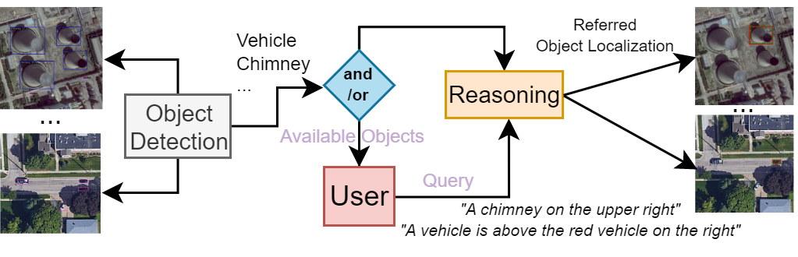
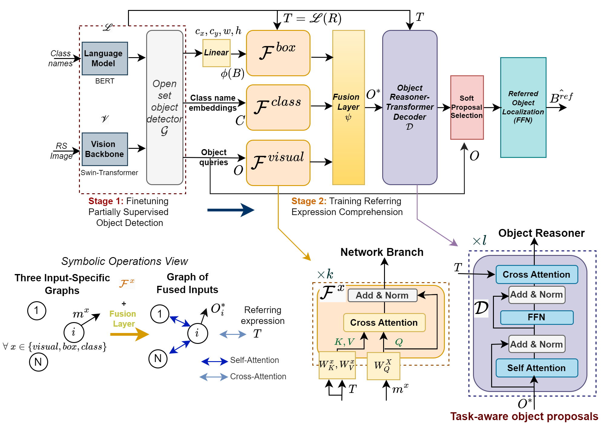
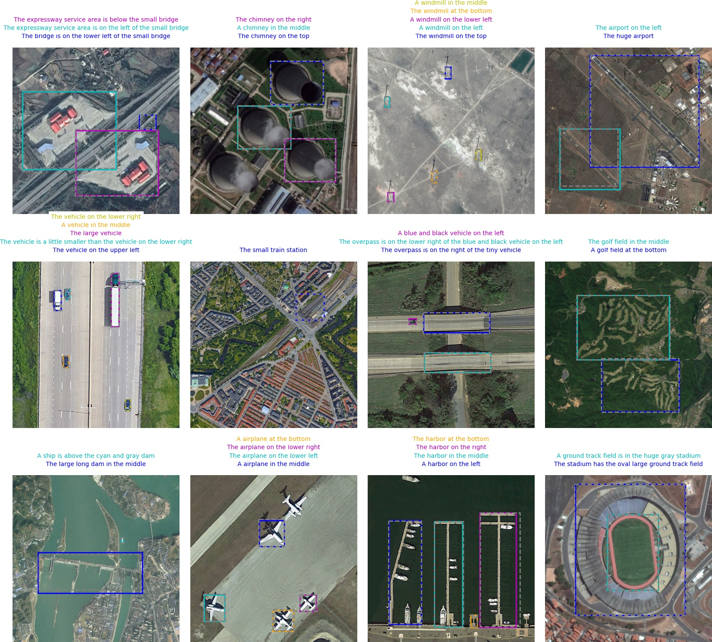
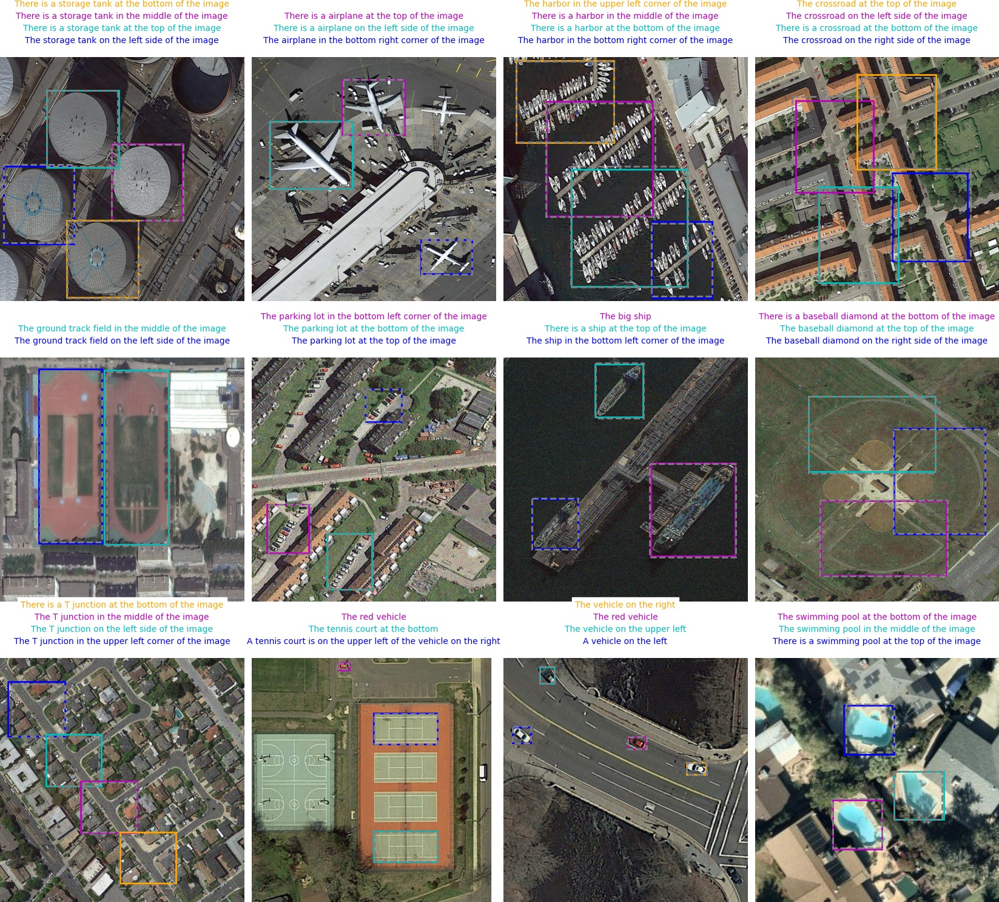
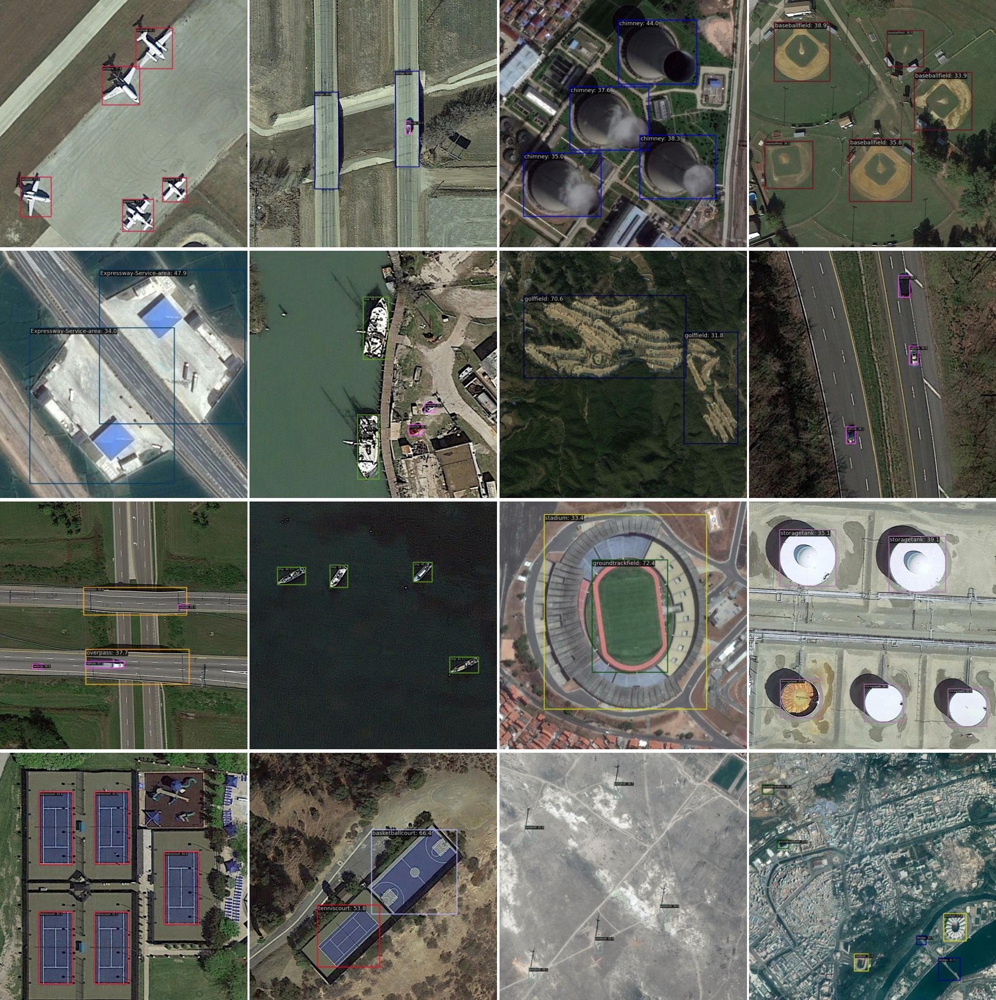
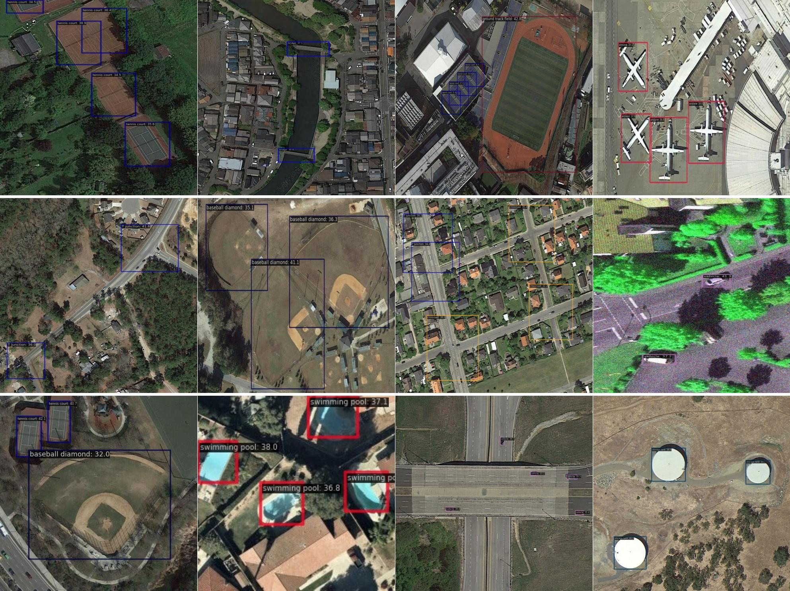
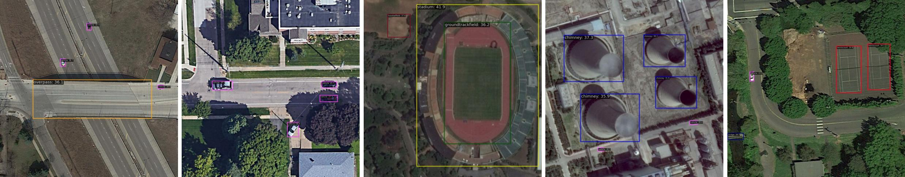
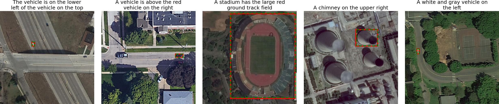

## Description

Official implementation of the paper:

<div align="center">

[<span style="font-size: 25px;"> <span style="color:darkorange; font-weight:darkbold; font-size: 30px">MB-ORES: A Multi-Branch Object Reasoner for
Visual Grounding in Remote Sensing</span>](https://arxiv.org/abs/2503.24219v1)

[](https://arxiv.org/pdf/2503.24219v1)
[]()

</div>

## Concept and goal
Our framework is designed to retain object detection capabilities while providing users with essential information to simplify query formulation for their object of interest.

<div align="center">
    
</div>


## Architecture

We propose a unified framework that integrates object detection (OD) and visual grounding (VG) for remote sensing (RS) imagery. 
To support conventional OD and establish an intuitive prior for VG task, we fine-tune an open-set object detector using referring expression data, framing it as a partially supervised OD task. In the first stage, we construct a graph representation of each image, comprising object queries, class embeddings, and proposal locations. Then, our task-aware architecture processes this graph to perform the VG task. The model consists of: (i) a multi-branch network that integrates spatial, visual, and categorical features to generate task-aware proposals, and (ii) an object reasoning network that assigns probabilities across proposals, followed by a soft selection mechanism for final referring object localization. Our model demonstrates superior performance on the OPT-RSVG and DIOR-RSVG datasets, achieving significant improvements over state-of-the-art methods while retaining classical OD capabilities.

<div align="center">
    
</div>


## Quantitative Results

\* <span style="color:darkorange; font-weight:bold; font-size: 20px;">OPT-RSVG</span>

| **Methods** | **Venue** | **Visual Encoder** | **Language Encoder** | **Pr@0.5** | **Pr@0.6** | **Pr@0.7** | **Pr@0.8** | **Pr@0.9** | **meanIoU** | **cmuIoU** |
|------------|----------|-------------------|-------------------|------------|------------|------------|------------|------------|------------|------------|
| NMTree | ICCV'19 | ResNet-101 | BiLSTM | 69.28 | 64.17 | 55.22 | 40.31 | 12.90 | 60.12 | 69.85 |
| Ref-NMS  | AAAI'21 | ResNet-101 | Bi-GRU | 70.59 | 65.61 | 58.01 | 41.36 | 14.58 | 60.42 | 70.72 |
| LBYL-Net  | CVPR'21 | DarkNet-53 | BERT | 70.22 | 65.39 | 58.65 | 37.54 | 9.46 | 60.57 | 70.28 |
| TransVG  | CVPR'21 | ResNet-50 | BERT | 69.96 | 64.17 | 54.68 | 38.01 | 12.75 | 59.80 | 69.31 |
| VLTVG | CVPR'22 | ResNet-101 | BERT | 73.50 | 68.31 | 59.93 | 43.45 | 15.31 | 62.84 | 73.80 |
| MGVLF | TGRS'23 | ResNet-50 | BERT | _72.19_ | 66.86 | 58.02 | 42.51 | 15.30 | 61.51 | 71.80 |
| LPVA  | TGRS'24 | ResNet-50 | BERT | 78.03 | 73.32 | 62.22 | 49.60 | 25.61 | 66.20 | 76.30 |
| **MB-ORES (Ours)** | - | Swin-T | BERT | **83.81** | **81.54** | **76.40** | **63.82** | **36.01** | **73.18** | **79.29** |


\* <span style="color:darkorange; font-weight:bold; font-size: 20px;">DIOR-RSVG</span>

| **Methods** | **Venue** | **Visual Encoder** | **Language Encoder** | **Pr@0.5** | **Pr@0.6** | **Pr@0.7** | **Pr@0.8** | **Pr@0.9** | **meanIoU** | **cmuIoU** |
|------------|----------|-------------------|-------------------|------------|------------|------------|------------|------------|------------|------------|
| ReSC  | ECCV'20 | DarkNet-53 | BERT | 72.71 | 68.92 | 63.01 | 53.70 | 33.37 | 64.24 | 68.10 |
| LBYL-Net  | CVPR'21 | DarkNet-53 | BERT | 73.78 | 69.22 | 65.56 | 47.89 | 15.69 | 65.92 | 76.37 |
| TransVG  | CVPR'21 | ResNet-50 | BERT | 72.41 | 67.38 | 60.05 | 49.10 | 27.84 | 63.56 | 76.27 |
| QRNet  | CVPR'22 | Swin | BERT | 75.84 | 70.82 | 62.27 | 49.63 | 25.69 | 66.80 | 83.02 |
| EarthGPT  | TGRS'24 | ViT | Llama-2 | 76.65 | 71.93 | 66.52 | 56.53 | 37.63 | 69.34 | 81.54 |
| GeoGround  | - | CLIP-ViT | Vicuna 1.5 | 77.73 | - | - | - | - | - | - |
| VLTVG  | CVPR'22 | ResNet-101 | BERT | 75.79 | 72.22 | 66.33 | 55.17 | 33.11 | 66.32 | 77.85 |
| MGVLF  | TGRS'23 | ResNet-50 | BERT | 76.78 | 72.68 | 66.74 | 56.42 | 35.07 | 68.04 | 78.41 |
| LPVA  | TGRS'24 | ResNet-50 | BERT | 82.27 | 77.44 | 72.25 | 60.98 | 39.55 | 72.35 | **85.11** |
| **MB-ORES (Ours)** | - | Swin-T | BERT | **85.65** | **83.89** | **80.87** | **73.00** | **54.39** | **77.73** | 83.06 |

\* <span style="color:darkorange; font-weight:bold; font-size: 20px;">Ablation Study</span>

Our Multi-branch based design significantly improves the performance of the VG task.

<table>
  <thead>
    <tr>
      <th rowspan="2"># Heads / # Layers</th>
      <th rowspan="2">Multi-Branch</th>
      <th rowspan="2">Object Reasoner</th>
      <th rowspan="2">#Params.</th>
      <th colspan="2">DIOR-RSVG</th>
      <th colspan="2">OPT-RSVG</th>
    </tr>
    <tr>
      <th>MeanIoU</th>
      <th>CmuIoU</th>
      <th>MeanIoU</th>
      <th>CmuIoU</th>
    </tr>
  </thead>
  <tbody>
    <!-- First Block: Multi-Branch (4,1) -->
    <tr>
      <td rowspan="6">(h, l/k)</td>
      <td rowspan="2">(4,1)</td>
      <td>(4,3)</td>
      <td>6.38M</td>
      <td>77.18</td>
      <td>81.67</td>
      <td>72.15</td>
      <td>78.27</td>
    </tr>
    <tr>
      <td>(8,6)</td>
      <td>11.13M</td>
      <td>77.26</td>
      <td>81.71</td>
      <td>72.37</td>
      <td>78.31</td>
    </tr>
    <!-- Second Block: Multi-Branch (4,3) -->
    <tr>
      <td rowspan="2"><strong>(4,3)</strong></td>
      <td>(4,3)</td>
      <td>7.97M</td>
      <td><strong>77.73</strong></td>
      <td><strong>83.06</strong></td>
      <td><em>72.73</em></td>
      <td><em>78.60</em></td>
    </tr>
    <tr>
      <td>(8,6)</td>
      <td>12.70M</td>
      <td><em>77.72</em></td>
      <td><em>82.42</em></td>
      <td><strong>73.18</strong></td>
      <td><strong>79.29</strong></td>
    </tr>
    <!-- Third Block: Multi-Branch × -->
    <tr>
      <td rowspan="2">×</td>
      <td>(4,3)</td>
      <td>5.13M</td>
      <td>73.50</td>
      <td>77.94</td>
      <td>66.04</td>
      <td>72.54</td>
    </tr>
    <tr>
      <td>(8,6)</td>
      <td>9.87M</td>
      <td>73.93</td>
      <td>78.43</td>
      <td>66.38</td>
      <td>73.26</td>
    </tr>
  </tbody>
</table>

## Qualitative Results

* <span style="color:cyan; font-weight:bold; font-size: 20px;">Referring Expression Comprehension (REC)</span>

Visualization of referring objects for multiple referring expression queries per image.

<center>
  <h1>DIOR-RSVG</h1>
</center>

<div align="center">

</div>

<center>
  <h1>OPT-RSVG</h1>
</center>


<div align="center">

</div>

* <span style="color:cyan; font-weight:bold; font-size: 20px;">Object Detection (OD)</span>

<center>
  <h1>DIOR-RSVG</h1>
</center>

<div align="center">
    
</div>

<center>
  <h1>OPT-RSVG</h1>
</center>


<div align="center">
    
</div>

* <span style="color:cyan; font-weight:bold; font-size: 20px;">Unification of REC and OD</span>

Simultaneous object detection and referring object localization.

<div align="center">
<br>

</div>


## Bibtex
If you find this work useful in your research, please cite:
```
@article{radouane2025mboresmultibranchobjectreasoner,
      title={MB-ORES: A Multi-Branch Object Reasoner for Visual Grounding in Remote Sensing}, 
      author={Karim Radouane and Hanane Azzag and Mustapha lebbah},
      year={2025},
      eprint={2503.24219},
      archivePrefix={arXiv},
      primaryClass={cs.CV},
      url={https://arxiv.org/abs/2503.24219}, 
}
```
